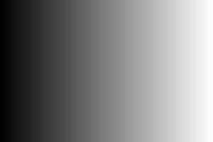
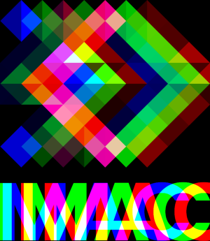
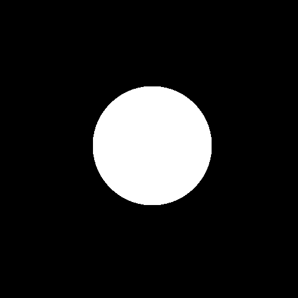
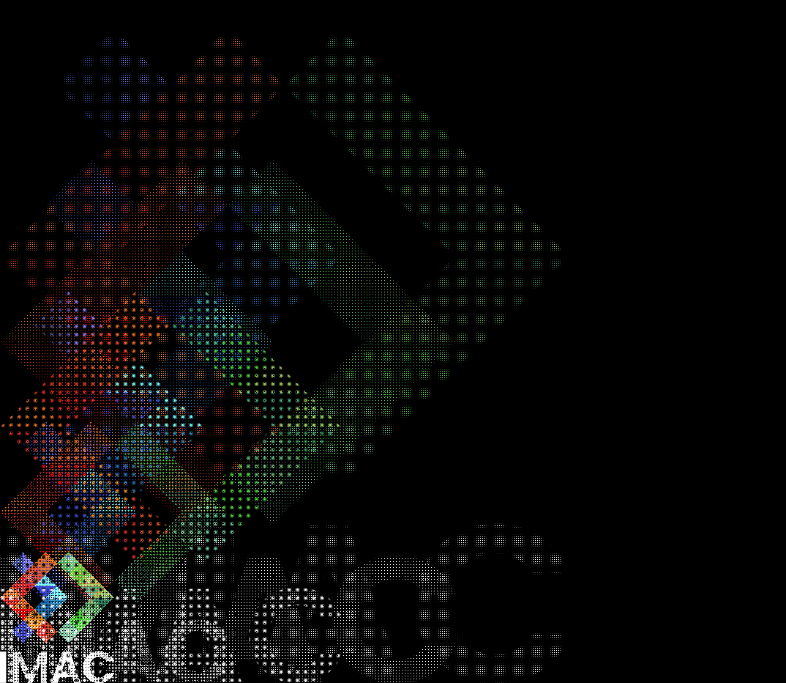
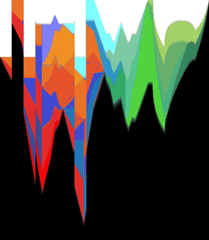
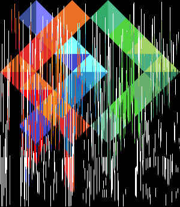

# 🐣 S1 | Prog : Workshop | Anne & Justine


- [🐣 S1 | Prog : Workshop | Anne \& Justine](#-s1--prog--workshop--anne--justine)
  - [⭐ Ne garder que le vert](#-ne-garder-que-le-vert)
  - [⭐ Échanger les canaux](#-échanger-les-canaux)
  - [⭐ Noir \& blanc](#-noir--blanc)
  - [⭐ Négatif](#-négatif)
  - [⭐ Dégradé](#-dégradé)
  - [⭐⭐ Miroir](#-miroir)
  - [⭐⭐ Image bruitée](#-image-bruitée)
  - [⭐⭐ Rotation de 90°](#-rotation-de-90)
  - [⭐⭐ RGB split](#-rgb-split)
  - [⭐⭐ Luminosité](#-luminosité)
  - [⭐⭐ Disque](#-disque)
  - [⭐ Cercle](#-cercle)
  - [⭐⭐⭐ Rosace](#-rosace)
  - [⭐⭐ Mosaïque](#-mosaïque)
  - [⭐⭐⭐ Mosaïque miroir](#-mosaïque-miroir)
  - [⭐⭐⭐ Glitch](#-glitch)
  - [⭐⭐⭐ Fractale de Mandelbrot](#-fractale-de-mandelbrot)
  - [⭐⭐⭐(⭐) Vortex](#-vortex)
  - [⭐⭐⭐(⭐) Tramage](#-tramage)
  - [⭐⭐⭐(⭐) Normalisation de l'histogramme](#-normalisation-de-lhistogramme)
  - [⭐⭐⭐⭐ Convolutions](#-convolutions)
    - [⭐ Netteté, Contours, etc.](#-netteté-contours-etc)
    - [⭐⭐ Différence de gaussiennes](#-différence-de-gaussiennes)
  - [⭐⭐⭐⭐ Convolutions](#-convolutions-1)


## ⭐ Ne garder que le vert  

Avant : 

Après : 


## ⭐ Échanger les canaux 

Avant : 

Après : 


## ⭐ Noir & blanc

Avant : 

Après : 


## ⭐ Négatif

Avant : 

Après : 


## ⭐ Dégradé
 


Nous avons eu un petit peu de difficulté à prendre en main la double boucle `for` car c'était la première fois qu'on l'utilisait. 

<details><summary>Voir le code</summary>

```cpp
  void gradient() {
    sil::Image gradient{300, 200};
    float light {0.f};
    for (int x{0}; x < gradient.height(); x++)
    {
        for (int y{0}; y < gradient.width(); y++)
        {
            gradient.pixel(y, x).r += light;
            gradient.pixel(y, x).g += light;
            gradient.pixel(y, x).b += light;
            light += (1.f / 300.f);
        }
        light = 0.f;
    }
    gradient.save("output/gradient.png");
}
```
</details>


## ⭐⭐ Miroir

Avant : 

Après : 


On a passé les pixels à gauche de l'axe de symétrie à droite et inversement.

<details><summary>Voir le code</summary>

```cpp
void mirror(sil::Image image) {
    float stock_r {};
    float stock_g {};
    float stock_b {};
    for (int x{0}; x < image.width()/2; x++)
    {
        for (int y{0}; y < image.height(); y++)
        {
            // On stocke les couleurs des pixels à gauche de notre axe de symétrie
            stock_r = image.pixel(x, y).r;
            stock_g = image.pixel(x, y).g;
            stock_b = image.pixel(x, y).b;

            // On attribue la couleurs des pixels à droite de note axe de symétrie aux pixels à gauche de notre axe de symétrie
            image.pixel(x, y).r = image.pixel(image.width()-x-1, y).r;
            image.pixel(x, y).g = image.pixel(image.width()-x-1, y).g;
            image.pixel(x, y).b = image.pixel(image.width()-x-1, y).b;

            // On attribue l'ancienne couleur (maintenant stokée) des pixels à gauche de note axe de symétrie aux pixels à gauche de notre axe
            image.pixel(image.width()-x-1, y).r = stock_r;
            image.pixel(image.width()-x-1, y).g = stock_g;
            image.pixel(image.width()-x-1, y).b = stock_b;
        }
    }
    image.save("output/miror.png");
}
```
</details>


## ⭐⭐ Image bruitée

Avant : 

Après : 


Pour chaque pixel de l'image, on utilise `random` pour lui attribuer une probabilité d'avoir du bruit, puis pour choisir une couleur au hazard s'il doit être bruité. 

```cpp
int rand {random_int(0, 4)};
if (rand == 1) { // 1 chance sur 5 de brouiller mon pixel
    color.r = random_float(0.0f, 1.0f);
    color.g = random_float(0.0f, 1.0f);
    color.b = random_float(0.0f, 1.0f);
}
```


## ⭐⭐ Rotation de 90°

Avant : 

Après : 


Nous avons vite remarqué qu'il fallait recréer une image à partir de 0 en prenant bien en compte que les dimentions de hauteur et de largeur sont inversées par rapport à l'image originelle (sans quoi la rotation va dépasser du cadre).

```cpp
sil::Image new_image {image.height(), image.width()};
```


## ⭐⭐ RGB split

Avant : 

Après : 


Nous avons vite remarqué qu'il fallait recréer une image à partir de 0, sinon certains pixels utiliseraient les couleurs déjà modifiées au lieu des couleurs de l'image de base.
Chaque pixel va prendre le rouge d'un pixel à sa gauche, son propre vert et le bleu d'un pixel à sa droite. Nous avons effectué un décalage du rouge et du bleu de 30 pixels.

<details><summary>Voir le code</summary>

```cpp
void rgbSplit(sil::Image image) {
    sil::Image new_image {image.width(), image.height()};
    for (int x{0}; x < image.width(); x++)
    {
        for (int y{0}; y < image.height(); y++)
        {
            new_image.pixel(x, y).g = image.pixel(x, y).g;
            // On gère le rouge
            if (x-30 >=0) {
                new_image.pixel(x, y).r = image.pixel(x-30, y).r;
            }
            // On gère le bleu
            if (x+30 < image.width()) {
                new_image.pixel(x, y).b = image.pixel(x+30, y).b;
            }
        }
    }
    new_image.save("output/rgbSplit.png");
}
```
</details>


## ⭐⭐ Luminosité

Image de base : 

Plus lumineux : 

Moins lumineux : 


Nous avons vu que pour augmenter la luminosité, il faut mettre la luminosité de chaque pixel à la racine carrée (puissance 0,5) : 
```cpp
color.r = pow(color.r, 0.5f);
color.g = pow(color.g, 0.5f);
color.b = pow(color.b, 0.5f);`
```
Pour diminuer la luminosité, il faut mettre la luminosité de chaque pixel au carré (puissance 2) : 
```cpp
color.r = pow(color.r, 2.0f);
color.g = pow(color.g, 2.0f);
color.b = pow(color.b, 2.0f);`
```


## ⭐⭐ Disque



Nous avons colorié en blanc tous les pixels à une distance inférieure à 100px du centre de l'image.

```cpp
if (pow (pow(x-255, 2.0f) + pow(y-255, 2.0f), 0.5f) < 100) {
    disk.pixel(y, x).r = 1.0f;
    disk.pixel(y, x).g = 1.0f;
    disk.pixel(y, x).b = 1.0f;
}
```


## ⭐ Cercle


Nous avons colorié en blanc tous les pixels à une distance inférieure à 100px et supérieure à 90px du centre de l'image.

```cpp
if ((pow (pow(x-255, 2.0f) + pow(y-255, 2.0f), 0.5f) < 100) && (pow (pow(x-255, 2.0f) + pow(y-255, 2.0f), 0.5f) > 90)) {
    disk.pixel(y, x).r = 1.0f;
    disk.pixel(y, x).g = 1.0f;
    disk.pixel(y, x).b = 1.0f;
}
```


## ⭐⭐⭐ Rosace


Nous avons d'abord tracé un cercle au centre de l'image. Puis nous avons tracé les cercles qui sont autours. La principale difficulté a été de trouver les coordonnées des centres des cercles périphériques.
Nous avons alors remarqué que les centres des cercles périphériques étaient situés tous les `i * PI/3` avec i allant de 0 à 5. Nous avons ainsi appliqué les formules `cos(i*M_PI/3)` pour trouver la coordonnée x de leur centre et `sin(i*M_PI/3)` pour la coordonnée y.

```cpp
// Deuxième boucle pour les autres cercles 
for (int i {}; i<6 ; ++i) 
{
    int x_centre = cos(i*M_PI/3)*100+255 ;
    int y_centre = sin(i*M_PI/3)*100+255 ;
    for (int x{0}; x < rosace.height(); x++)
    {
        for (int y{0}; y < rosace.width(); y++)
        {
            if ((pow (pow(x-x_centre, 2.0f) + pow(y-y_centre, 2.0f), 0.5f) < 100) && (pow (pow(x-x_centre, 2.0f) + pow(y-y_centre, 2.0f), 0.5f) > 95)) {
                rosace.pixel(y, x).r = 1.0f;
                rosace.pixel(y, x).g = 1.0f;
                rosace.pixel(y, x).b = 1.0f;
            }
        }
    }
}
```


## ⭐⭐ Mosaïque

En essayant de faire la mosaïque, nous avons accidentellement créé une image très originale et jolie.

Échec :


Réussite :


Nous avons créé une image 6 fois plus grande que l'image de base, puis nous avons itéré pour copier l'image de base 6 fois pour chaque ligne.

<details><summary>Voir le code</summary>

```cpp
void mosaic(sil::Image image) {
    sil::Image new_image {image.width()*5, image.height()*5};
    for (int i=0; i<5; i++) 
    {
        for (int j=0; j<5; j++) 
        {
            for (int x{0}; x < image.width(); x++)
            {
                for (int y{0}; y < image.height(); y++)
                {
                    new_image.pixel(i*300+x, j*345+y).r = image.pixel(x, y).r;
                    new_image.pixel(i*300+x, j*345+y).g = image.pixel(x, y).g;
                    new_image.pixel(i*300+x, j*345+y).b = image.pixel(x, y).b;
                }
            }
        }
    }
    new_image.save("output/mosaic.png");
}
```
</details>


## ⭐⭐⭐ Mosaïque miroir


Nous avons suivi le même principe que pour la mosaïque classique. Sauf que pour chaque petite image de rang x paire nous lui avons appliqué une symétrie verticale, et pour chaque petite image de rang y paire une symétrie horizontale.

```cpp
// Choix d'une symétrie verticale ou non
if (i%2 == 1) {
    x_direction = image.width()-x-1; // Symétrie
} else {
    x_direction = x;
}
// Choix d'une symétrie horizontale ou non
if (j%2 == 1) {
    y_direction = image.height()-y-1; // Symétrie
} else {
    y_direction = y;
}

// Affichage de l'image
new_image.pixel(i*300+x, j*345+y).r = image.(x_direction, y_direction).r;
new_image.pixel(i*300+x, j*345+y).g = image.(x_direction, y_direction).g;
new_image.pixel(i*300+x, j*345+y).b = image.(x_direction, y_direction).b;
```


## ⭐⭐⭐ Glitch

Avant : 

Après : 


On a reprit le code du bruitage, avec le même principe d'utilisation de `random`. Mais il faut en plus créer des rectangle de taille aléatoire, qui représente une partie de l'image, et pas juste prendre un pixel. Pour échanger deux rectangles on a utilisé la fonction `swap`.

```cpp
  for (int x{0}; x < rand_x1; x++)
  {
      for (int y{0}; y < rand_y1; y++)
      {
          std::swap(image.pixel(x, y).r, image.pixel((x+rand_x2)%image.width(), (y+rand_y2)%image.height()).r); // modulo pour eviter de sortir de l'image
          std::swap(image.pixel(x, y).g, image.pixel((x+rand_x2)%image.width(), (y+rand_y2)%image.height()).g);
          std::swap(image.pixel(x, y).b, image.pixel((x+rand_x2)%image.width(), (y+rand_y2)%image.height()).b);
      }
  }
```


## ⭐⭐⭐ Fractale de Mandelbrot


Comme nous savions que les nombres intéressant allaient de -2 à 2, nous avons testé tous les nombres `c` de -2,5 à 2,5 avec un pas de 0,01. Pour chacun de ces nombres, nous avons alors fait 50 itérations de `z = (z * z) + c`, en retenant à chaque fois au bout de combien d'itérations notre `z` dépassait 2 dans une variable `counter`. Cela permettait ensuite de colorier le pixel correspondant avec un niveau de gris plus ou moins sombre, en lui appliquant la couleur `counter / 50`. Pour les nombres qui ne dépassaient toujours pas 2 après nos itérations, nous avons mis le compteur à 50 afin de leur attribuer la couleur blanche (1.0f).
Enfin, pour placer nos pixels au bon endroit sur notre image, nous avons multiplié leurs coordonées x et y par 100 pour les remettre à l'échelle, puis nous leur avons ajouté 250 (soit la moitié de la taille de l'image) pour les recentrer dans l'image.

```cpp
void fractale() {
    sil::Image fractale{500, 500};
    int counter {};
    for (float x{-2.5f}; x < 2.5f; x+=0.01f)
    {
        for (float y{-2.5f}; y < 2.5f; y+=0.01f)
        {
            std::complex<float> c {x,y};
            std::complex<float> z {0.0f, 0.0f};
            // Calcul du nombre d'itérations nécésaires à ce que abs(z) dépasse 2
            for (int i{0}; i<50; i++) {
                z = (z * z) + c;
                if (std::abs(z) >= 2.f) {
                    counter = i;
                    break;
                }
            }
            // Cas où abs(z) est toujours inférieur à 2
            if (std::abs(z) < 2.f) {
                counter = 50;
            } 
            // Coloriage des pixel 
            fractale.pixel(x*100+250,y*100+250).r = static_cast<float>(counter)/50.0f;
            fractale.pixel(x*100+250,y*100+250).g = static_cast<float>(counter)/50.0f;
            fractale.pixel(x*100+250,y*100+250).b = static_cast<float>(counter)/50.0f;
        }
    }
    fractale.save("output/fractale.png");
}
```


## ⭐⭐⭐(⭐) Vortex

Avant : 

Intermédiare :

Après : 


Exercice assez compliqué. On a eu du mal à comprendre comment marchait la fonction `rotated`. Une fois cela compris, on a voulu tester une simple rotation d'image à 90° en gérant les pixels qui se retrouvaient à l'extérieur du cadre de l'image. 
```cpp
glm::vec2 point{x, y};
glm::vec2 center_of_rotation{image.width()/2, image.height()/2};
glm::vec2 new_point{rotated(point, center_of_rotation , 90)};

if(new_point.y<vortex.height() && new_point.x<vortex.width() && new_point.y>0 && new_point.x>0) { 
    vortex.pixel(x, y) = image.pixel(new_point.x, new_point.y);
}
```

Ensuite, il a fallu faire une rotation en fonction de la distance de chaque pixel par rapport au centre de l'image. Le resultat obtenu est celui de l'image intermediaire. On a essayer de comprendre pourquoi on obtenait l'image intermédiaire : c'est simplement car on faisait une rotation trop importante. 

```cpp
glm::vec2 point{x, y};
glm::vec2 center_of_rotation{image.width()/2, image.height()/2};
glm::vec2 new_point{rotated(point, center_of_rotation ,pow((pow((x-image.width()/2),2)+pow((y-image.height()/2),2)),0.5))};

if(new_point.y<vortex.height() && new_point.x<vortex.width() && new_point.y>0 && new_point.x>0) { 
    vortex.pixel(x, y) = image.pixel(new_point.x, new_point.y);
}
```

Il fallait donc reduire l'angle de rotation, c'est pourquoi on a décidé de le diviser par 10, mais on peut choisir la valeur que l'on veut en fonction du résultat que l'on souhaite.

```cpp
glm::vec2 point{x, y};
glm::vec2 center_of_rotation{image.width()/2, image.height()/2};
glm::vec2 new_point{rotated(point, center_of_rotation ,pow((pow((x-image.width()/2),2)+pow((y-image.height()/2),2)),0.5)/10) };

if(new_point.y<vortex.height() && new_point.x<vortex.width() && new_point.y>0 && new_point.x>0) { 
    vortex.pixel(x, y) = image.pixel(new_point.x, new_point.y);
}
```


## ⭐⭐⭐(⭐) Tramage

Avant : 

Après: 


Pour le tramage, il fallait donner à chaque la probabilité de se colorer en blanc fonction de sa luminosité. Trouver une manière d'exprimer cette probabilité a été la partie la plus pointue de l'exercice. Nous avons donc testé si un nombre aléatoire entre 0 (noir) et 1 (blanc) était inférieur à la luminosité d'un pixel. Si oui, il se colorait en blanc, si non en noir.

```cpp
// On calcule la probabilité d'un pixel à être coloré en blanc en fonction de sa luminosité
float white_proba = (image.pixel(x,y).r + image.pixel(x,y).g + image.pixel(x,y).b) / 3.f;
if (random_float(0.f, 1.f) < white_proba) {
    image.pixel(x, y) = glm::vec3{1};
} else {
    image.pixel(x, y) = glm::vec3{0};
}
```


## ⭐⭐⭐(⭐) Normalisation de l'histogramme

Avant : 

Après: 


Nous avons dans un premier temps cherché la luminosité du pixel le plus lumineux et du pixel le moins lumineux.

```cpp
float min {1.f}; // Plus petite luminosité
float max {0.f}; // Plus grande luminosité

for (int x{0}; x < image.width(); x++)
{
    for (int y{0}; y < image.height(); y++)
    {   
        // On cherche le pixel avec le moins de lumière
        if ((image.pixel(x,y).r + image.pixel(x,y).g + image.pixel(x,y).b)/3.f < min) {
            min = (image.pixel(x,y).r + image.pixel(x,y).g + image.pixel(x,y).b)/3.f;
        }
        // On cherche le pixel avec le plus de lumière
        if ((image.pixel(x,y).r + image.pixel(x,y).g + image.pixel(x,y).b)/3.f > max) {
            max = (image.pixel(x,y).r + image.pixel(x,y).g + image.pixel(x,y).b)/3.f;
        }
    }
} 
```

Nous avons ensuite transformer la luminosité de chaque pixel pour le réadapté de sorte à ce que la plus grande luminosité devienne du blanc et la plus petite du noir. Nous avons pour cela soustrait la plus petite luminosité à la luminosité de chaque pixel puis nous avons multiplié le résultat par `1 / la plus grande luminosité`.

```cpp
// Action sur les pixels
for (int x{0}; x < image.width(); x++)
{
    for (int y{0}; y < image.height(); y++)
    {   
        image.pixel(x,y).r -= min;
        image.pixel(x,y).g -= min;
        image.pixel(x,y).b -= min;
        
        image.pixel(x,y).r *= 1.f / max;
        image.pixel(x,y).g *= 1.f / max;
        image.pixel(x,y).b *= 1.f / max;
    }
} 
```


## ⭐⭐⭐⭐ Convolutions

Avant : 

Après : 


Sur cet exercice, il fallait parcourir les pixels autour du pixel de base puis faire la moyenne des couleurs de chaque pixel pour l'attribuer à notre pixel de base. Au début on a essayé de faire un flou léger en prennant une matrice de 1px autour du pixel de base. 
Ensuite, il a fallu essayer de faire avec une matrice qui pouvait prendre n'importe quelle taille (afin que l'utilisateur puisse choisir l'intensité de son flou). 
Le piège principale dans lequel on est tombé est qu'on modifiait la variable `x_offset` et `y_offset` qui étaient nos variables d'entrée de nos boucles for. On faisait donc une boucle infinie. C'est pour cela qu'on a créé deux nouvelles variables `real_x_offset` et `real_y_offset`.

```cpp
sil::Image blur(sil::Image image, int level) {
    sil::Image new_image{image.width(), image.height()};
    for (int x{0}; x < image.width(); x++)
    {
        for (int y{0}; y < image.height(); y++)
        {
            glm::vec3 sum {0.f};
            int size {level}; //taille de la matrice 
            for (int x_offset{-size}; x_offset < size; x_offset++)
            {
                for (int y_offset{-size}; y_offset < size; y_offset++)
                {
                    int real_x_offset{x_offset};
                    int real_y_offset{y_offset};
                    if (x+real_x_offset<0 || x+real_x_offset>=image.width())
                    {
                        real_x_offset = 0; //si le pixel de la matrice est en dehors de l'image alors le décalage par rapport a x est nul.
                    }
                    if (y+real_y_offset<0 || y+real_y_offset>=image.height())
                    {
                        real_y_offset = 0;//si le pixel de la matrice est en dehors de l'image alors le décalage par rapport a y est nul.
                    }
                    sum += image.pixel(x+real_x_offset,y+real_y_offset);
                }
            }
            sum /= pow(2*size+1,2);//moyenne
            new_image.pixel(x,y)=sum;
        }
    }
    new_image.save("output/blur.png"); 
    return new_image;
}
```

### ⭐ Netteté, Contours, etc.

**Emboss** : 

**Outline** : 

**Sharpen** : 


Pour réaliser ces exercices, nous avons repris notre algorithme de convolution et nous l'avons légèrement adapté. 
La différence est qu'au lieu d'attribuer à un pixel la moyenne des couleurs de ses pixels voisins, nous lui avons attribué la couleur de ses pixels voisins multipliée par des coefficients présents dans des matrices spécifiques qui sont passées en paramètre. Ces matrices de 9 coefficients diffèrent selon l'effet que l'on veut appliquer à notre image.

```cpp
void applyKernel(std::vector<std::vector<float>> kernel, sil::Image & image, std::string name) {
    sil::Image new_image{image.width(), image.height()};
    // On parcourt tous les pixels de notre image
    for (int x{0}; x < image.width(); x++)
    {
        for (int y{0}; y < image.height(); y++)
        {
            glm::vec3 sum {0.f};
            int size {1};
            // On parcourt tous les pixels de notre kernel
            for (int x_offset{-size}; x_offset <= size; x_offset++)
            {
                for (int y_offset{-size}; y_offset <= size; y_offset++)
                {
                    int real_x_offset{x_offset};
                    int real_y_offset{y_offset};
                    if (x+real_x_offset<0 || x+real_x_offset>=image.width()) {
                        real_x_offset = 0;
                    }
                    if (y+real_y_offset<0 || y+real_y_offset>=image.height()) {
                        real_y_offset = 0;
                    }
                    sum += image.pixel(x+real_x_offset,y+real_y_offset) * kernel[1+real_x_offset][1+real_y_offset];
                }
            }
            // On applique la couleur trouvée au pixel de l'image parcouru
            new_image.pixel(x,y) = sum;
        }
    }
    new_image.save("output/"+name+".png"); 
}
```

Exemple d'appels de la fonction `applyKernel()` avec des matrices d'effets différents :

```cpp
applyKernel({{-1.f, -1.f, -1.f},{-1.f, 8.f, -1.f},{-1.f, -1.f, -1.f}}, image, "outline"); // effet outline
applyKernel({{-2.f, -1.f, 0.f}, {-1.f, 1.f, 1.f}, {0.f, 1.f, 2.f}}, image, "emboss"); // effet emboss
applyKernel({{0.f, -1.f, -0.f}, {-1.f, 5.f, -1.f}, {0.f, -1.f, 0.f}}, image, "sharpen"); // effet sharpen
```

### ⭐⭐ Différence de gaussiennes

Pour réaliser cet exercice, il fallait soustraire une image peu floue à une image très floue. Nous avons fait différents tests avec des niveaux de flou plus ou moins importants. Nous avons eu des difficulté à trouver des niveaux de flou permettant de donner un résultat satisfaisant.

Avant : 

Premier test de valeurs de flou : 

Deuxième test de valeurs de flou : 


## ⭐⭐⭐⭐ Tri de pixels

Avant : 

En triant verticalement tous les pixels : 

En triant verticalement un nombre aléatoire de pixels par ligne : 


Nous avons récupéré chaque ligne de pixels, puis nous avons trié un nombre aléatoire de pixels par ligne en fonction de leur luminosité, et nous avons réaffectée ces lignes de pixels triée à l'image originale.

```cpp
void sortPixels(sil::Image image) {
    for (int x{0}; x < image.width(); x++)
    {
        // On récupère chaque ligne de pixels
        std::vector<glm::vec3> line {};
        int rand = random_int(0,image.height()-1);
        for (int y{0}; y < rand; y++)
        {
            line.push_back(image.pixel(x,y));
        }
        // On effectue le tri
        std::sort(line.begin(), line.end(), [](glm::vec3 const& color1, glm::vec3 const& color2)
        {
            return brightness(color1) < brightness(color2);
        });
        // On réafecte le tableau de pixels triés à l'image de base
        for (int i{0}; i < line.size(); i++)
        {
            image.pixel(x,i) = line[i];
        }
    }
    image.save("output/sortPixels.png");
}
```
