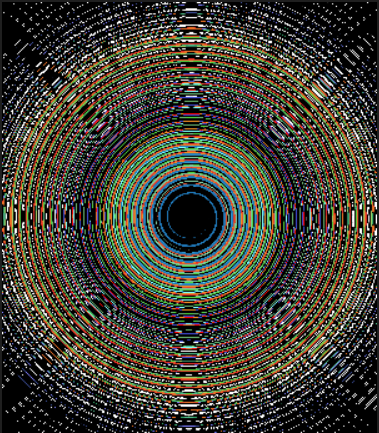

# 🐣 S1 | Prog : Workshop | Anne & Justine


- [🐣 S1 | Prog : Workshop | Anne \& Justine](#-s1--prog--workshop--anne--justine)
  - [⭐ Ne garder que le vert](#-ne-garder-que-le-vert)
  - [⭐ Échanger les canaux](#-échanger-les-canaux)
  - [⭐ Noir \& blanc](#-noir--blanc)
  - [⭐ Négatif](#-négatif)
  - [⭐ Dégradé](#-dégradé)
  - [⭐⭐ Miroir](#-miroir)
  - [⭐⭐ Image bruitée](#-image-bruitée)
  - [⭐⭐ Rotation de 90°](#-rotation-de-90)
  - [⭐⭐ RGB split](#-rgb-split)
  - [⭐⭐ Luminosité](#-luminosité)
  - [⭐⭐ Disque](#-disque)
  - [⭐ Cercle](#-cercle)
  - [⭐⭐⭐ Rosace](#-rosace)
  - [⭐⭐ Mosaïque](#-mosaïque)
  - [⭐⭐⭐ Mosaïque miroir](#-mosaïque-miroir)
  - [⭐⭐⭐ Glitch](#-glitch)
  - [⭐⭐⭐ Fractale de Mandelbrot](#-fractale-de-mandelbrot)
  - [⭐⭐⭐(⭐) Vortex](#-vortex)
  - [⭐⭐⭐(⭐) Tramage](#-tramage)
  - [⭐⭐⭐(⭐) Normalisation de l'histogramme](#-normalisation-de-lhistogramme)
  - [⭐⭐⭐⭐ Convolutions](#-convolutions)
    - [⭐ Netteté, Contours, etc.](#-netteté-contours-etc)
    - [⭐⭐ Différence de gaussiennes](#-différence-de-gaussiennes)


## ⭐ Ne garder que le vert  

Avant : 

Après : 


## ⭐ Échanger les canaux 

Avant : 

Après : 


## ⭐ Noir & blanc

Avant : 

Après : 


## ⭐ Négatif

Avant : 

Après : 


## ⭐ Dégradé
 


Nous avons eu un petit peu de difficulté à prendre en main la double boucle `for` car c'était la première fois qu'on l'utilisait. 

<details><summary>Voir le code</summary>

```cpp
  void gradient() {
    sil::Image gradient{300, 200};
    float light {0.f};
    for (int x{0}; x < gradient.height(); x++)
    {
        for (int y{0}; y < gradient.width(); y++)
        {
            gradient.pixel(y, x).r += light;
            gradient.pixel(y, x).g += light;
            gradient.pixel(y, x).b += light;
            light += (1.f / 300.f);
        }
        light = 0.f;
    }
    gradient.save("output/gradient.png");
}
```
</details>


## ⭐⭐ Miroir

Avant : 

Après : 


On a passé les pixels à gauche de l'axe de symétrie à droite et inversement.

<details><summary>Voir le code</summary>

```cpp
void mirror(sil::Image image) {
    float stock_r {};
    float stock_g {};
    float stock_b {};
    for (int x{0}; x < image.width()/2; x++)
    {
        for (int y{0}; y < image.height(); y++)
        {
            // On stocke les couleurs des pixels à gauche de notre axe de symétrie
            stock_r = image.pixel(x, y).r;
            stock_g = image.pixel(x, y).g;
            stock_b = image.pixel(x, y).b;

            // On attribue la couleurs des pixels à droite de note axe de symétrie aux pixels à gauche de notre axe de symétrie
            image.pixel(x, y).r = image.pixel(image.width()-x-1, y).r;
            image.pixel(x, y).g = image.pixel(image.width()-x-1, y).g;
            image.pixel(x, y).b = image.pixel(image.width()-x-1, y).b;

            // On attribue l'ancienne couleur (maintenant stokée) des pixels à gauche de note axe de symétrie aux pixels à gauche de notre axe
            image.pixel(image.width()-x-1, y).r = stock_r;
            image.pixel(image.width()-x-1, y).g = stock_g;
            image.pixel(image.width()-x-1, y).b = stock_b;
        }
    }
    image.save("output/miror.png");
}
```
</details>


## ⭐⭐ Image bruitée

Avant : 

Après : 


Pour chaque pixel de l'image, on utilise `random` pour lui attribuer une probabilité d'avoir du bruit, puis pour choisir une couleur au hazard s'il doit être bruité. 

```cpp
int rand {random_int(0, 4)};
if (rand == 1) { // 1 chance sur 5 de brouiller mon pixel
    color.r = random_float(0.0f, 1.0f);
    color.g = random_float(0.0f, 1.0f);
    color.b = random_float(0.0f, 1.0f);
}
```


## ⭐⭐ Rotation de 90°

Avant : 

Après : 


Nous avons vite remarqué qu'il fallait recréer une image à partir de 0 en prenant bien en compte que les dimentions de hauteur et de largeur sont inversées par rapport à l'image originelle (sans quoi la rotation va dépasser du cadre).

```cpp
sil::Image new_image {image.height(), image.width()};
```


## ⭐⭐ RGB split

Avant : 

Après : 


Nous avons vite remarqué qu'il fallait recréer une image à partir de 0, sinon certains pixels utiliseraient les couleurs déjà modifiées au lieu des couleurs de l'image de base.
Chaque pixel va prendre le rouge d'un pixel à sa gauche, son propre vert et le bleu d'un pixel à sa droite. Nous avons effectué un décalage du rouge et du bleu de 30 pixels.

<details><summary>Voir le code</summary>

```cpp
void rgbSplit(sil::Image image) {
    sil::Image new_image {image.width(), image.height()};
    for (int x{0}; x < image.width(); x++)
    {
        for (int y{0}; y < image.height(); y++)
        {
            new_image.pixel(x, y).g = image.pixel(x, y).g;
            // On gère le rouge
            if (x-30 >=0) {
                new_image.pixel(x, y).r = image.pixel(x-30, y).r;
            }
            // On gère le bleu
            if (x+30 < image.width()) {
                new_image.pixel(x, y).b = image.pixel(x+30, y).b;
            }
        }
    }
    new_image.save("output/rgbSplit.png");
}
```
</details>


## ⭐⭐ Luminosité

Image de base : 
{ width=300px }
Plus lumineux : 
{ width=300px }
Moins lumineux : 
{ width=300px }

Nous avons vu que pour augmenter la luminosité, il faut mettre la luminosité de chaque pixel à la racine carrée (puissance 0,5) : 
```cpp
color.r = pow(color.r, 0.5f);
color.g = pow(color.g, 0.5f);
color.b = pow(color.b, 0.5f);`
```
Pour diminuer la luminosité, il faut mettre la luminosité de chaque pixel au carré (puissance 2) : 
```cpp
color.r = pow(color.r, 2.0f);
color.g = pow(color.g, 2.0f);
color.b = pow(color.b, 2.0f);`
```


## ⭐⭐ Disque

{ width=300px }

Nous avons colorié en blanc tous les pixels à une distance inférieure à 100px du centre de l'image.

```cpp
if (pow (pow(x-255, 2.0f) + pow(y-255, 2.0f), 0.5f) < 100) {
    disk.pixel(y, x).r = 1.0f;
    disk.pixel(y, x).g = 1.0f;
    disk.pixel(y, x).b = 1.0f;
}
```


## ⭐ Cercle

{ width=300px }

Nous avons colorié en blanc tous les pixels à une distance inférieure à 100px et supérieure à 90px du centre de l'image.

```cpp
if ((pow (pow(x-255, 2.0f) + pow(y-255, 2.0f), 0.5f) < 100) && (pow (pow(x-255, 2.0f) + pow(y-255, 2.0f), 0.5f) > 90)) {
    disk.pixel(y, x).r = 1.0f;
    disk.pixel(y, x).g = 1.0f;
    disk.pixel(y, x).b = 1.0f;
}
```


## ⭐⭐⭐ Rosace

{ width=300px }

Nous avons d'abord tracé un cercle au centre de l'image. Puis nous avons tracé les cercles qui sont autours. La principale difficulté a été de trouver les coordonnées des centres des cercles périphériques.
Nous avons alors remarqué que les centres des cercles périphériques étaient situés tous les `i * PI/3` avec i allant de 0 à 5. Nous avons ainsi appliqué les formules `cos(i*M_PI/3)` pour trouver la coordonnée x de leur centre et `sin(i*M_PI/3)` pour la coordonnée y.

```cpp
// Deuxième boucle pour les autres cercles 
for (int i {}; i<6 ; ++i) 
{
    int x_centre = cos(i*M_PI/3)*100+255 ;
    int y_centre = sin(i*M_PI/3)*100+255 ;
    for (int x{0}; x < rosace.height(); x++)
    {
        for (int y{0}; y < rosace.width(); y++)
        {
            if ((pow (pow(x-x_centre, 2.0f) + pow(y-y_centre, 2.0f), 0.5f) < 100) && (pow (pow(x-x_centre, 2.0f) + pow(y-y_centre, 2.0f), 0.5f) > 95)) {
                rosace.pixel(y, x).r = 1.0f;
                rosace.pixel(y, x).g = 1.0f;
                rosace.pixel(y, x).b = 1.0f;
            }
        }
    }
}
```


## ⭐⭐ Mosaïque

En essayant de faire la mosaïque, nous avons accidentellement créé une image très originale et jolie.

Échec :
{ width=300px }

Réussite :
{ width=300px }

Nous avons créé une image 6 fois plus grande que l'image de base, puis nous avons itéré pour copier l'image de base 6 fois pour chaque ligne.

<details><summary>Voir le code</summary>

```cpp
void mosaic(sil::Image image) {
    sil::Image new_image {image.width()*5, image.height()*5};
    for (int i=0; i<5; i++) 
    {
        for (int j=0; j<5; j++) 
        {
            for (int x{0}; x < image.width(); x++)
            {
                for (int y{0}; y < image.height(); y++)
                {
                    new_image.pixel(i*300+x, j*345+y).r = image.pixel(x, y).r;
                    new_image.pixel(i*300+x, j*345+y).g = image.pixel(x, y).g;
                    new_image.pixel(i*300+x, j*345+y).b = image.pixel(x, y).b;
                }
            }
        }
    }
    new_image.save("output/mosaic.png");
}
```
</details>


## ⭐⭐⭐ Mosaïque miroir

{ width=300px }

Nous avons suivi le même principe que pour la mosaïque classique. Sauf que pour chaque petite image de rang x paire nous lui avons appliqué une symétrie verticale, et pour chaque petite image de rang y paire une symétrie horizontale.

```cpp
// Choix d'une symétrie verticale ou non
if (i%2 == 1) {
    x_direction = image.width()-x-1; // Symétrie
} else {
    x_direction = x;
}
// Choix d'une symétrie horizontale ou non
if (j%2 == 1) {
    y_direction = image.height()-y-1; // Symétrie
} else {
    y_direction = y;
}

// Affichage de l'image
new_image.pixel(i*300+x, j*345+y).r = image.(x_direction, y_direction).r;
new_image.pixel(i*300+x, j*345+y).g = image.(x_direction, y_direction).g;
new_image.pixel(i*300+x, j*345+y).b = image.(x_direction, y_direction).b;
```


## ⭐⭐⭐ Glitch

Avant : 

Après : 


On a reprit le code du bruitage, avec le même principe d'utilisation de `random`. Mais il faut en plus créer des rectangle de taille aléatoire, qui représente une partie de l'image, et pas juste prendre un pixel. Pour échanger deux rectangles on a utilisé la fonction `swap`.

```cpp
  for (int x{0}; x < rand_x1; x++)
  {
      for (int y{0}; y < rand_y1; y++)
      {
          std::swap(image.pixel(x, y).r, image.pixel((x+rand_x2)%image.width(), (y+rand_y2)%image.height()).r); // modulo pour eviter de sortir de l'image
          std::swap(image.pixel(x, y).g, image.pixel((x+rand_x2)%image.width(), (y+rand_y2)%image.height()).g);
          std::swap(image.pixel(x, y).b, image.pixel((x+rand_x2)%image.width(), (y+rand_y2)%image.height()).b);
      }
  }
```


## ⭐⭐⭐ Fractale de Mandelbrot

{ width=300px }


## ⭐⭐⭐(⭐) Vortex

Avant : 

Intermédiare :
{ width=300px }
Après : 


Exercice assez compliqué. On a eu du mal à comprendre comment marchait la fonction `rotated`. Une fois cela compris, on a voulu tester une simple rotation d'image à 90° en gérant les pixels qui se retrouvaient à l'extérieur du cadre de l'image. 
```cpp
glm::vec2 point{x, y};
glm::vec2 center_of_rotation{image.width()/2, image.height()/2};
glm::vec2 new_point{rotated(point, center_of_rotation , 90)};

if(new_point.y<vortex.height() && new_point.x<vortex.width() && new_point.y>0 && new_point.x>0) { 
    vortex.pixel(x, y) = image.pixel(new_point.x, new_point.y);
}
```

Ensuite, il a fallu faire une rotation en fonction de la distance de chaque pixel par rapport au centre de l'image. Le resultat obtenu est celui de l'image intermediaire. On a essayer de comprendre pourquoi on obtenait l'image intermédiaire : c'est simplement car on faisait une rotation trop importante. 

```cpp
glm::vec2 point{x, y};
glm::vec2 center_of_rotation{image.width()/2, image.height()/2};
glm::vec2 new_point{rotated(point, center_of_rotation ,pow((pow((x-image.width()/2),2)+pow((y-image.height()/2),2)),0.5))};

if(new_point.y<vortex.height() && new_point.x<vortex.width() && new_point.y>0 && new_point.x>0) { 
    vortex.pixel(x, y) = image.pixel(new_point.x, new_point.y);
}
```

Il fallait donc reduire l'angle de rotation, c'est pourquoi on a décidé de le diviser par 10, mais on peut choisir la valeur que l'on veut en fonction du résultat que l'on souhaite.

```cpp
glm::vec2 point{x, y};
glm::vec2 center_of_rotation{image.width()/2, image.height()/2};
glm::vec2 new_point{rotated(point, center_of_rotation ,pow((pow((x-image.width()/2),2)+pow((y-image.height()/2),2)),0.5)/10) };

if(new_point.y<vortex.height() && new_point.x<vortex.width() && new_point.y>0 && new_point.x>0) { 
    vortex.pixel(x, y) = image.pixel(new_point.x, new_point.y);
}
```


## ⭐⭐⭐(⭐) Tramage

Avant : 
{ width=300px }
Après: 
{ width=300px }


## ⭐⭐⭐(⭐) Normalisation de l'histogramme

Avant : 
{ width=300px }
Après: 
{ width=300px }


## ⭐⭐⭐⭐ Convolutions

Avant : 

Après : 


Sur cet exercice, il fallait parcourir les pixels autour du pixel de base puis faire la moyenne des couleurs de chaque pixel pour l'attribuer à notre pixel de base. Au début on a essayé de faire un flou léger en prennant une matrice de 1px autour du pixel de base. 
Ensuite, il a fallu essayer de faire avec une matrice qui pouvait prendre n'importe quelle taille (afin que l'utilisateur puisse choisir l'intensité de son flou). 
Le piège principale dans lequel on est tombé est qu'on modifiait la variable `x_offset` et `y_offset` qui étaient nos variables d'entrée de nos boucles for. On faisait donc une boucle infinie. C'est pour cela qu'on a créé deux nouvelles variables `real_x_offset` et `real_y_offset`.

```cpp
sil::Image blur(sil::Image image, int level) {
    sil::Image new_image{image.width(), image.height()};
    for (int x{0}; x < image.width(); x++)
    {
        for (int y{0}; y < image.height(); y++)
        {
            glm::vec3 sum {0.f};
            int size {level}; //taille de la matrice 
            for (int x_offset{-size}; x_offset < size; x_offset++)
            {
                for (int y_offset{-size}; y_offset < size; y_offset++)
                {
                    int real_x_offset{x_offset};
                    int real_y_offset{y_offset};
                    if (x+real_x_offset<0 || x+real_x_offset>=image.width())
                    {
                        real_x_offset = 0; //si le pixel de la matrice est en dehors de l'image alors le décalage par rapport a x est nul.
                    }
                    if (y+real_y_offset<0 || y+real_y_offset>=image.height())
                    {
                        real_y_offset = 0;//si le pixel de la matrice est en dehors de l'image alors le décalage par rapport a y est nul.
                    }
                    sum += image.pixel(x+real_x_offset,y+real_y_offset);
                }
            }
            sum /= pow(2*size+1,2);//moyenne
            new_image.pixel(x,y)=sum;
        }
    }
    new_image.save("output/blur.png"); 
    return new_image;
}
```

### ⭐ Netteté, Contours, etc.

**Emboss** : 

**Outline** : 

**Sharpen** : 


Pour réaliser ces exercices, nous avons repris notre algorithme de convolution et nous l'avons légèrement adapté. 


### ⭐⭐ Différence de gaussiennes

Pour réaliser cet exercice, il fallait soustraire une image peu floue à une image très floue. Nous avons fait différents tests avec des niveaux de flou plus ou moins importants. Nous avons eu des difficulté à trouver des niveaux de flou permettant de donner un résultat satisfaisant.

Premier test de valeurs de flou : 
{ width=300px }

Deuxième test de valeurs de flou : 
{ width=300px }

